# Urban-Drone-Race

------------

- [Urban-Drone-Race](#urban-drone-race)
  - [1. Abstract](#1-abstract)
  - [2. Environment and Building](#2-environment-and-building)
    - [2.1 Environment](#21-environment)
    - [2.2 How to Build](#22-how-to-build)
  - [3. Tool Introduction](#3-tool-introduction)
    - [3.1 Unity](#31-unity)
      - [3.1.1 Unity Engine](#311-unity-engine)
      - [3.1.2 Unity Editor](#312-unity-editor)
      - [3.1.3 Unity Game’s structure](#313-unity-games-structure)
      - [3.1.4 Working in Unity](#314-working-in-unity)
    - [3.2 Mapbox](#32-mapbox)
      - [3.2.1 City Simulator](#321-city-simulator)
      - [3.2.2 Base Map](#322-base-map)
    - [3.3 Blender](#33-blender)
  - [4. Main functions implemented](#4-main-functions-implemented)
    - [4.1 Overview](#41-overview)
    - [4.2 Script Introduction](#42-script-introduction)
    - [4.3 Controls](#43-controls)
  - [5. Demo](#5-demo)
  - [6. Resources](#6-resources)

------------

## 1. Abstract

This project is a third-person free-to-control drone city flight game based on the Unity platform. This game scene is based on the 3D city simulation scene provided by Mapbox SDK for Unity, with different cities and map styles designed. In this game, players can switch between different drone models and urban scenes, and explore freely within the urban scene. Of course, you can also start a tense and exciting racing mode. In the racing mode, you need to pass as many checkpoints as possible in a limited time to get a higher score, and at the same time be careful not to collide with buildings. Come and experience the flight tour in different cities!

**Keywords:** Drone Game, Unity, Mapbox, Blender3D, City Model

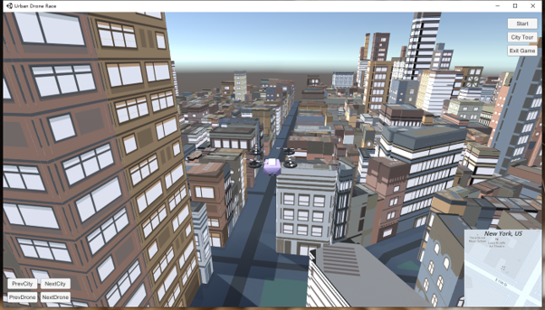 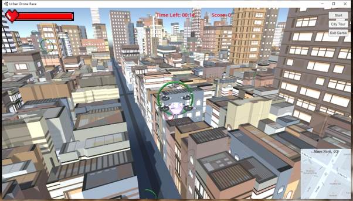

Fig 1.1 Overview of the game

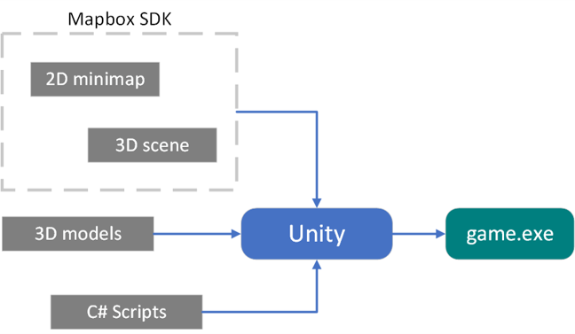

Fig 1.2 Overview of the project

------------

## 2. Environment and Building

### 2.1 Environment

Unity 2020.3.22f1(LTS)   
Visual Studio 2019

### 2.2 How to Build

- For developer:
Download the project - Open Unity Editor - Projects - ADD - Import our project - Assets - Scenes - UrbanRace

- For player:
Download the project - Open "UrbanDroneRaceEXE/Urban Drone Race.exe"

------------

## 3. Tool Introduction

### 3.1 Unity

[Unity](https://en.wikipedia.org/wiki/Unity_(game_engine)) is a cross-platform game engine developed by Unity Technologies. Unity3D consists of a UnityEngine and a UnityEditor. 

#### 3.1.1 Unity Engine

The engine contains software components for the most common and recurring tasks in game development. The topics covered by the engine include sound, graphics, physics and network functions. The engine supports C#, Boo, and JavaScript for script programming.

#### 3.1.2 Unity Editor

Unity Editor serves as an integrated development environment with a project panel for scripts and other components, a hierarchical object inspector containing the game scene setup and a game preview window (Fig 3.1).

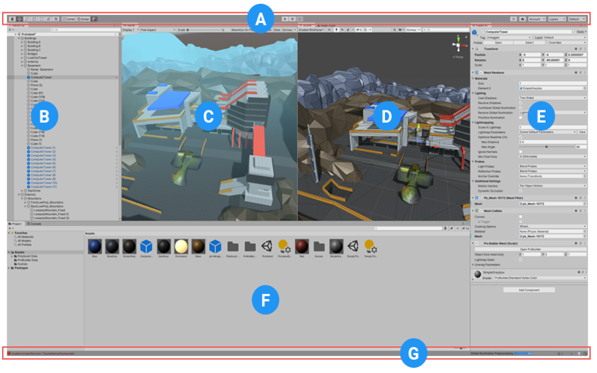

Fig 3.1 Unity Editor Interface

- A. The Toolbar
- B. The Hierarchy window
- C. The Game view
- D. The Scene view
- E. The Inspector window
- F. The Project window
- G. The status bar

#### 3.1.3 Unity Game’s structure

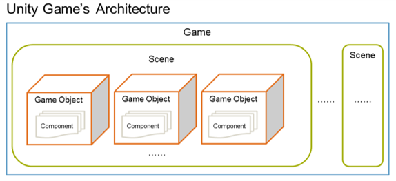

Fig 3.2 Logical structure of Unity game

#### 3.1.4 Working in Unity

- **Scene**
Scenes are where you work with content in Unity. They are assets that contain all or part of a game or application.
- **GameObjects**
The GameObject is the most important concept in the Unity Editor. Every object in your game is a GameObject
- **Prefabs**
The Prefab Asset acts as a template from which you can create new Prefab instances in the Scene.
- **Layers**
Layers in Unity define which GameObjects can interact with different features and one another.

### 3.2 Mapbox

The project uses [Mapbox Unity SDK](https://docs.mapbox.com/unity/maps/guides/) as the main provider for 3D city maps. 

#### 3.2.1 City Simulator

[City Simulator](https://docs.mapbox.com/unity/maps/examples/city-simulator/) is a scene of a selected coordinate or city’s name with 3D features  such as buildings and terrain with elevation. To visualise a map, this example scene comes ready with the CitySimulatorMap prefab.

Users can change location, image, terrain and map layers in this prefab. The scene can be extended to add any other custom features that you want.

#### 3.2.2 Base Map

Our project uses Mapbox Studio to style the base maps according to the theme of the game. Mapbox Studio allows us to customise the base map and their elements, adjust the width and the size of the elements, the colours and the patterns of the highways and the buildings and other map attributes that make the map pop up and add a character to it to include in the game! 

We have three cities depicted in our game:
- New York
- Hamburg
- Tokyo

Each of the cities are iterated with a style unique to the city and capturing its theme. The added styles are: 
- Boom
- Manhattan 
- Navigation 

**Colour themes:**
- Boom: 

             
- Manhattan:

            
- Navigation: 

         
**Elements:**

_Editing the style element_

_Editing the attribute_

### 3.3 Blender

The drone models used in this project are manually modelled in Blender 3D from the basic cubes.
+ red - Outliner
+ Green - Properties
+ Yellow - 3D view

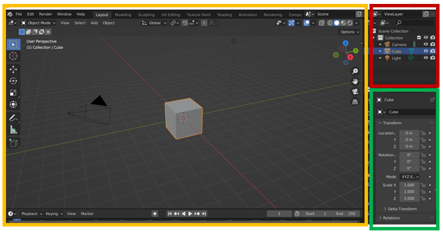

Fig 3.3 Interface of Blender 3D

Here are some of the models we made using Blender 3D.

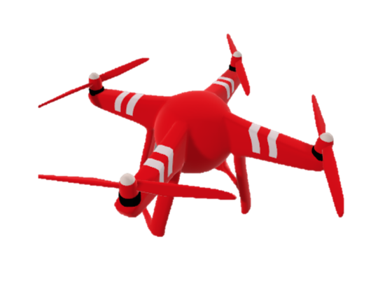 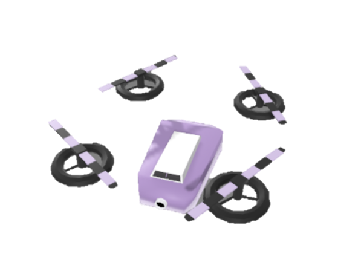 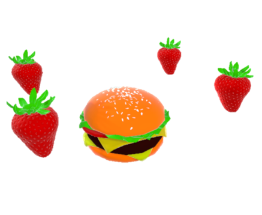
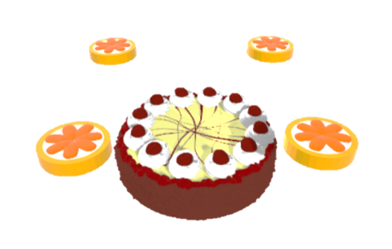 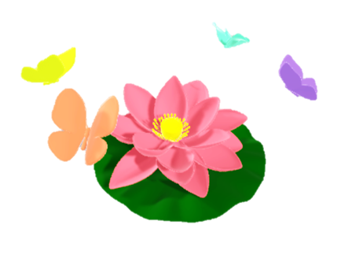 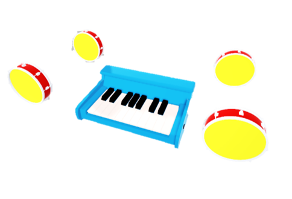

------------

## 4. Main functions implemented

### 4.1 Overview

Currently the following features have been implemented:

+ Map selection
+ Drone model selection
+ Drone health decrease with the collision with buildings
+ Mini-map
+ Start menu
+ Checkpoints mode
  - Score
  - Timer

### 4.2 Script Introduction

+ StartGame.cs - Controls the start of the game and the display of the interface.
Score.cs - The score begins as zero at the start of the game, refresh throughout the game, and display final score at the end.
+ TextScore.cs - Show score during the game.
+ Timer.cs - The countdown starts when the game starts, the game ends when the countdown is zero.
+ DroneMovementScript.cs - Control the movement of the drone by keyboard.
+ MiniMapCam.cs - The minimap shows the drone's current location on a 2D map from an orthographic perspective.
+ MiniMapCityName.cs - Show the name of the current city.
+ HealthBar.cs - Show the current health of the drone.
+ DroneHealth.cs - At the beginning of the game, the healthy bar is full. When the drone collides with other objects in the scene, it will lose blood. When the healthy bar is zero, the game ends.
+ CheckPoint.cs - Three different types of checkpoints randomly generated as the game starts every time, and automatically destroyed as the game ends. The checkpoint will disappear when a drone crosses and changes the score.
+ ChangeDrone.cs - Change of drone model.
+ ChangeCity.cs - Change of city model.
+ BladeRotation.cs - Uav blade rotation animation.
+ ExitGame.cs - Quit the game.

### 4.3 Controls

Drone can be controlled by using WASD and IJKL keys.

------------

## 5. Demo

------------

## 6. Resources

https://unity.com/   
https://docs.unity3d.com/ScriptReference/index.html   
https://docs.unity3d.com/Manual/index.html   
https://docs.mapbox.com/unity/maps/guides/   
https://www.blender.org/   

------------
